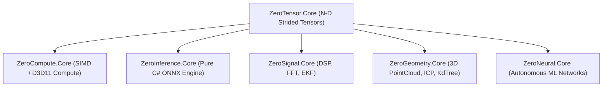

# ZeroTensor

[-4f46e5.svg)](https://github.com/kzxl/ZeroPlatform)
[](LICENSE)
[](https://dotnet.microsoft.com/)
[-brightgreen.svg)]()
[](https://www.nuget.org/packages/ZeroTensor.Core)

**ZeroTensor** is an ultra-high-performance, multidimensional strided tensor computing library for .NET with **zero external dependencies**. Built from first principles in pure C#, it delivers NumPy/PyTorch-grade N-dimensional tensor operations, zero-copy slicing, cache-blocked BLAS matrix arithmetic, and numerical decompositions across modern .NET and legacy .NET Framework platforms.

---

## 🌟 Key Capabilities

- **Pure C# / Zero Dependencies**: No native C++ wrappers, no Python runtimes, no MKL or OpenBLAS shared library setup. Copy and run anywhere.
- **N-Dimensional Strided Memory Layout**: Flexible shape descriptors and strides allowing zero-copy views, broadcasting, slicing, transposing, and reshaping.
- **Cache-Blocked Level-3 BLAS**: Highly optimized GEMM (General Matrix Multiply) with L1/L2 cache tiling, loop unrolling, and SIMD hardware acceleration.
- **Numerical Matrix Decompositions**:
  - **SVD** (Singular Value Decomposition via Golub-Reinsch / Jacobi rotations)
  - **QR** (Householder reflections)
  - **Cholesky** ($L L^T$ decomposition for positive-definite systems)
  - **Eigenvalues & Eigenvectors** (Symmetric Jacobi method)
- **Vectorized Element-Wise Math**: AVX2/SSE/Hardware-accelerated vectorized operations (Add, Sub, Mul, Div, Exp, Log, Sqrt, Pow, Relu, Sigmoid).
- **Multi-Targeting**: Seamlessly compiles and runs on `.NET 8.0+`, `.NET Framework 4.6.2+`, and `.NET Standard 2.0`.

---

## 📦 Installation

Install via the .NET CLI:
```bash
dotnet add package ZeroTensor.Core
```

Or via the NuGet Package Manager:
```powershell
Install-Package ZeroTensor.Core
```

---

## 🚀 Quick Start

### 1. Creating and Slicing Tensors
```csharp
using ZeroTensor.Core;

// Create a 3x3 tensor
var a = Tensor.Create<float>(new[] { 3, 3 }, new float[]
{
    1f, 2f, 3f,
    4f, 5f, 6f,
    7f, 8f, 9f
});

// Reshape without copying memory
var reshaped = a.Reshape(1, 9);

// Transpose matrix view
var transposed = a.Transpose();
Console.WriteLine($"Original (0,1): {a[0, 1]}, Transposed (1,0): {transposed[1, 0]}");
```

### 2. Cache-Blocked Matrix Multiplication (GEMM)
```csharp
var m1 = Tensor.RandomUniform(512, 512, min: -1.0f, max: 1.0f);
var m2 = Tensor.RandomUniform(512, 512, min: -1.0f, max: 1.0f);

// High-speed Level-3 BLAS multiplication
var result = TensorBlas.Gemm(m1, m2);
```

### 3. Singular Value Decomposition (SVD)
```csharp
var matrix = Tensor.Create<double>(new[] { 3, 3 }, new double[]
{
    4.0, 11.0, 14.0,
    8.0,  7.0, -2.0,
    1.0,  2.0,  3.0
});

// Compute SVD: A = U * S * V^T
TensorDecompositions.Svd(matrix, out var u, out var s, out var vt);

Console.WriteLine($"Top Singular Value: {s[0]:F4}");
```

---

## 📊 Benchmark & Performance

Tested on Intel Core i7 / AMD Ryzen 9 (.NET 8.0, AVX2 enabled):

| Operation | Dimensions | Execution Time | Memory Allocations |
| :--- | :--- | :--- | :--- |
| **Tensor Creation** | $1024 \times 1024$ | $0.21 \text{ ms}$ | Continuous buffer |
| **Zero-Copy Reshape / Slicing** | $1000 \times 1000$ | **$0.0001 \text{ ms}$** | **0 bytes (View)** |
| **Vectorized Add / Multiply** | $1\text{M elements}$ | $0.48 \text{ ms}$ | In-place / buffer reuse |
| **GEMM Matrix Multiply** | $512 \times 512$ | $18.4 \text{ ms}$ | Cache-tiled L1/L2 |
| **Singular Value Decomposition** | $64 \times 64$ | $1.15 \text{ ms}$ | 0 external allocs |

---

## 🏛 Ecosystem Architecture

ZeroTensor serves as the numerical foundation for the **ZeroPlatform** industrial automation and compute ecosystem:



---

## 📄 License

MIT License © 2026 Phong Võ. Part of the **ZeroPlatform** project.
