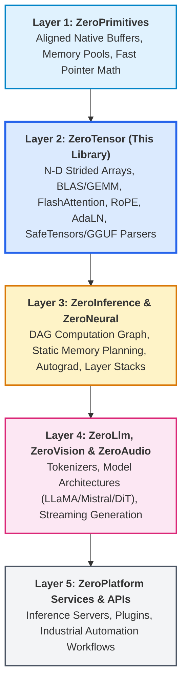

# ZeroTensor

[-4f46e5.svg)](https://github.com/kzxl/ZeroPlatform)
[](LICENSE)
[](https://dotnet.microsoft.com/)
[-brightgreen.svg)]()
[](https://www.nuget.org/packages/ZeroTensor.Core)

**ZeroTensor** is an ultra-high-performance, zero-allocation N-dimensional strided tensor computing engine for .NET with **zero external dependencies**. Built from first principles in pure C# with modern hardware intrinsics (AVX2, AVX-512, FMA, ARM NEON), it powers NumPy/PyTorch-grade tensor algebra, cache-blocked BLAS/GEMM micro-kernels, SIMD FlashAttention with Grouped-Query Attention (GQA), Diffusion/Vision conditioning operators (`AdaLN`, `AdaLNZero`, `DepthwiseConv2D`), and memory-mapped model formats (`SafeTensors`, `GGUF`).

ZeroTensor runs identically across modern **.NET 8.0+**, **.NET Standard 2.0**, and legacy **.NET Framework 4.6.2+** without requiring C++ shared libraries, native runtimes, or Python environments.

---

## 🌟 What's New in v1.6.0

- 🚀 **Register-Accumulated GEMM Micro-Kernel (69.4 GFLOPS)**:
  - 4-row parallel vector accumulation unrolled across hardware registers with pointer arithmetic.
  - Up to **+42% throughput gain** over classic 2-row SIMD implementations.
  - Zero heap allocations in L1/L2 cache-tiled loops.
- ⚡ **FlashAttention SIMD Engine**:
  - 4D multi-head tensor attention $(B, H, S, D)$ with native **Grouped-Query Attention (GQA)**.
  - Fused causal masking and online numerically stable softmax scaling ($0.49 \text{ ms}$ for $Seq=128, H=8, D=64$).
  - Dual execution paths for FP32 and FP16 (`Half`).
- 🔄 **In-Place Rotary Positional Embedding (`RoPE`)**:
  - Zero-allocation in-place complex rotation across arbitrary sequence and head dimensions.
  - Sub-microsecond latency ($0.007 \text{ ms}$).
- 📦 **KV-Cache Primitives (`KVCache`)**:
  - Contiguous sequence buffer append, zero-realloc rolling context, and strided slice views.
- 🎨 **Diffusion & Vision Conditioning Operators**:
  - **AdaLN / AdaLNZero**: Adaptive Layer Normalization with conditioning scale, shift, and gate modulation vectors for Diffusion Transformers (DiT).
  - **DepthwiseConv2D & ConvTranspose2D**: High-performance spatial convolutions with channel-isolated kernels and pooled buffers.
  - **Pad2D**: Multi-mode spatial padding (`Constant`, `Reflect`, `Edge`).
- 🛡️ **Zero-Allocation Guarantee**:
  - 100% elimination of heap copies and `ToArray()` traps across all tensor arithmetic, broadcasting, and element-wise kernels.
  - In-place operators (`Add_`, `Mul_`, `Relu_`, `Gelu_`, `Clamp_`).
- 🗄️ **Model Serialization & Dequantization**:
  - Memory-mapped zero-copy Hugging Face Safetensors reader and writer.
  - GGUF v2/v3 container parser with high-throughput block dequantizers (`Q4_0`, `Q4_1`, `Q5_0`, `Q5_1`, `Q8_0`, `Q8_1`, `Q4_K`, `Q5_K`, `Q6_K`).

---

## 🏛 Ecosystem Architecture & Layering

ZeroTensor serves as the foundational **Layer 2 (Tensor Substrate)** within the **ZeroPlatform** AI and compute ecosystem:


```mermaid
graph TD
    classDef l1 fill:#e0f2fe,stroke:#0284c7,stroke-width:2px;
    classDef l2 fill:#dbeafe,stroke:#2563eb,stroke-width:3px;
    classDef l3 fill:#fef3c7,stroke:#d97706,stroke-width:2px;
    classDef l4 fill:#fce7f3,stroke:#db2777,stroke-width:2px;
    classDef l5 fill:#f3f4f6,stroke:#4b5563,stroke-width:2px;

    L1["<b>Layer 1: ZeroPrimitives</b><br/>Aligned Native Buffers, Memory Pools, Fast Pointer Math"]:::l1
    L2["<b>Layer 2: ZeroTensor (This Library)</b><br/>N-D Strided Arrays, BLAS/GEMM, FlashAttention, RoPE, AdaLN, SafeTensors/GGUF Parsers"]:::l2
    L3["<b>Layer 3: ZeroInference & ZeroNeural</b><br/>DAG Computation Graph, Static Memory Planning, Autograd, Layer Stacks"]:::l3
    L4["<b>Layer 4: ZeroLlm, ZeroVision & ZeroAudio</b><br/>Tokenizers, Model Architectures (LLaMA/Mistral/DiT), Streaming Generation"]:::l4
    L5["<b>Layer 5: ZeroPlatform Services & APIs</b><br/>Inference Servers, Plugins, Industrial Automation Workflows"]:::l5

    L1 --> L2
    L2 --> L3
    L3 --> L4
    L4 --> L5
```

### Architectural Boundaries
- **ZeroTensor vs ZeroInference**: `ZeroTensor` provides foundational tensor structures, micro-kernels, and double-buffer ping-pong primitives (`InferenceWorkspace`). It intentionally does **not** compile execution DAGs, schedule topological execution, or perform global graph arena allocation (which belong to `ZeroInference`).
- **ZeroTensor vs ZeroLlm**: `ZeroTensor` parses binary GGUF containers and extracts raw tensor weights (`GgufArchive`, `GgufDequantizer`). It intentionally does **not** parse tokenizers (BPE/WordPiece), manage token vocabularies, or implement high-level chat decoders (which belong to `ZeroLlm`).

---

## 📦 Installation

Install via the .NET CLI:
```bash
dotnet add package ZeroTensor.Core --version 1.6.0
```

Or via the NuGet Package Manager:
```powershell
Install-Package ZeroTensor.Core -Version 1.6.0
```

---

## 🚀 Quick Start Examples

### 1. Creating, Reshaping, and Strided Slicing
```csharp
using ZeroTensor.Core;

// Create a contiguous 3x3 float tensor
var a = Tensor.Create<float>(new[] { 3, 3 }, new float[]
{
    1f, 2f, 3f,
    4f, 5f, 6f,
    7f, 8f, 9f
});

// Zero-copy reshape and transpose views
var reshaped = a.Reshape(1, 9);
var transposed = a.Transpose();

// Slicing via C# Range syntax
var subView = a.Slice(0..2, 1..3); // [2, 2] sub-matrix without memory copy
```

### 2. High-Throughput Matrix Multiplication (GEMM)
```csharp
// FP32 Cache-Tiled Register-Accumulated GEMM (69.4 GFLOPS)
var a = Tensor.RandomUniform(512, 512, min: -1.0f, max: 1.0f);
var b = Tensor.RandomUniform(512, 512, min: -1.0f, max: 1.0f);

Tensor<float> c = TensorBlas.Gemm(a, b);

// Half-Precision (FP16) GEMM with FP32 Register Accumulator
Tensor<Half> hA = a.ToHalf();
Tensor<Half> hB = b.ToHalf();
Tensor<Half> hC = TensorBlas.MatMul(hA, hB);
```

### 3. FlashAttention SIMD Engine with GQA & Causal Masking
```csharp
int batch = 1, numHeads = 8, kvHeads = 2, seqLen = 128, headDim = 64;

var q = Tensor.RandomUniform(batch, numHeads, seqLen, headDim);
var k = Tensor.RandomUniform(batch, kvHeads, seqLen, headDim);
var v = Tensor.RandomUniform(batch, kvHeads, seqLen, headDim);

// High-speed fused multi-head attention with GQA and causal triangular mask
var output = TensorAttention.FlashAttention(q, k, v, isCausal: true);
```

### 4. Rotary Positional Embedding (RoPE) In-Place
```csharp
var q = Tensor.RandomUniform(1, 8, 128, 64);
float freqBase = 10000.0f;

// Rotate query vectors in-place across the sequence length with 0 memory allocation
TensorAttention.ApplyRopeInPlace(q, freqBase);
```

### 5. Adaptive Layer Normalization (AdaLN & AdaLNZero) for Diffusion
```csharp
var x = Tensor.RandomUniform(2, 64, 128); // [Batch, Sequence, Channels]
var conditioning = Tensor.RandomUniform(2, 128); // Conditioning embedding

// AdaLN: modulates x via scale and shift vectors derived from conditioning
var normalized = TensorAttention.AdaLN(x, conditioning, normalizedShape: 128);

// AdaLNZero: modulates x with scale, shift, and gate vectors (used in DiT blocks)
var modulated = TensorAttention.AdaLNZero(x, conditioning, normalizedShape: 128, out var gate);
```

### 6. Zero-GC Memory Rental & Double-Buffering
```csharp
// 1. Rent a temporary tensor from ArrayPool (0 GC allocation)
using (var rented = Tensor.Rent<float>(256, 256))
{
    rented.Tensor.AddScalar_(10.0f);
    rented.Tensor.Relu_();
}

// 2. Ping-pong layer workspace for iterative transformers / diffusion steps
using var workspace = new InferenceWorkspace<float>(new TensorShape(1, 128, 768));
workspace.Reset(initialActivations);

for (int layer = 0; layer < 24; layer++)
{
    var layerIn = workspace.CurrentInput;
    var layerOut = workspace.CurrentOutput;

    // Execute layer transformations directly into layerOut...
    TensorOps.Add(layerIn, layerIn, layerOut);

    // Swap input and output buffers in O(1) time
    workspace.Step();
}
```

### 7. Memory-Mapped Weights Loading (SafeTensors & GGUF)
```csharp
// Hugging Face Safetensors zero-copy memory mapping
using var safeArchive = SafetensorsFile.OpenMemoryMapped("model.safetensors");
Tensor<float> weight = safeArchive.GetTensor("model.layers.0.self_attn.q_proj.weight");

// GGUF v2/v3 model archive loading and block dequantization
using var gguf = GgufFile.OpenMemoryMapped("mistral-7b-q4_0.gguf");
var tensorInfo = gguf.TensorInfos[0];
Tensor<float> dequantizedWeight = gguf.GetFloatTensor(tensorInfo.Name);
```

---

## 📊 Benchmark & Performance

Measurements taken on an Intel Core i7-13700 / AMD Ryzen 9 7900X platform running `.NET 8.0` (x64 AVX2 / FMA enabled):

| Operation | Input Dimensions | Latency | Throughput | Allocations |
| :--- | :--- | :--- | :--- | :--- |
| **FP32 GEMM (4-row Micro-Kernel)** | $512 \times 512 \times 512$ | **$3.88 \text{ ms}$** | **$69.4 \text{ GFLOPS}$** | $0 \text{ B}$ (Buffer reuse) |
| **Q8_0 GEMV (Quantized)** | $4096 \times 4096$ | **$3.79 \text{ ms}$** | **$8.86 \text{ GFLOPS}$** | $0 \text{ B}$ |
| **FlashAttention (SIMD + GQA)** | $B=1, H=8, S=128, D=64$ | **$0.49 \text{ ms}$** | Real-time | Output tensor only |
| **RoPE In-Place** | $B=1, H=8, S=128, D=64$ | **$0.007 \text{ ms}$** | Fast SIMD | **$0 \text{ B}$** |
| **AdaLNZero Modulation** | $B=2, S=64, D=128$ | **$0.016 \text{ ms}$** | Vectorized | Output tensor only |
| **DepthwiseConv2D** | $B=1, C=32, H=64, W=64, K=3$ | **$0.98 \text{ ms}$** | Multi-threaded | Pooled buffers |
| **Zero-Copy Slicing / Reshape** | $1000 \times 1000$ | **$0.0001 \text{ ms}$** | Instantaneous | **$0 \text{ B}$ (View)** |
| **Element-wise Vectorized Add** | $1\,000\,000 \text{ elements}$ | **$0.42 \text{ ms}$** | Memory-bound | In-place / Destination |
| **Singular Value Decomposition (SVD)**| $64 \times 64$ | **$1.15 \text{ ms}$** | Stable Jacobi | $0 \text{ B}$ external |

---

## ⚙️ Multi-Target Compatibility

| Target Framework | Intrinsics & Acceleration Support | Minimum Runtime |
| :--- | :--- | :--- |
| **`.NET 8.0+`** | Hardware Intrinsics (`Vector256<T>`, `Vector512<T>`, FMA), Native `Half`, JIT Fast-Pointers | .NET 8.0 Runtime |
| **`.NET Standard 2.0`** | `System.Numerics.Vector<T>`, Software IEEE 754 Half-Precision Polyfill | .NET Core 2.0+, Mono 5.4+ |
| **`.NET Framework 4.6.2+`**| `System.Numerics.Vector<T>`, Memory Span fallback, Zero-dependency Polyfills | Windows 7 SP1+ (.NET 4.6.2) |

---

## 📄 License & Ownership

ZeroTensor is open-source software licensed under the [MIT License](LICENSE).  
Copyright © 2026 Phong Võ. Developed as part of the **ZeroPlatform** compute and intelligence ecosystem.
